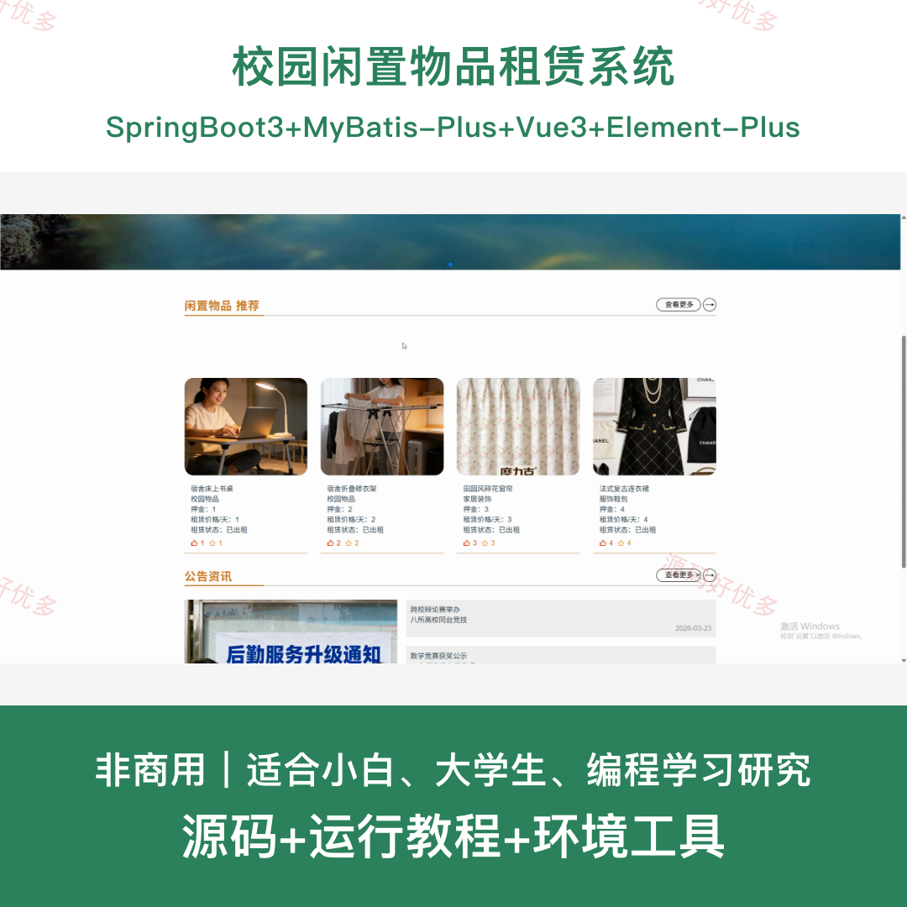
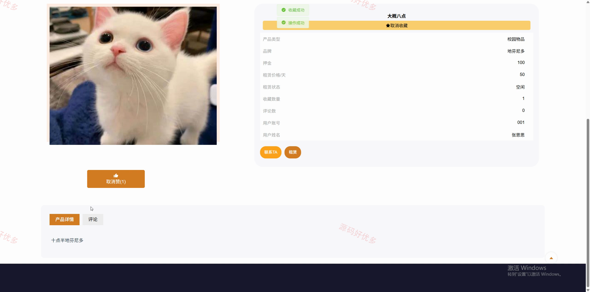
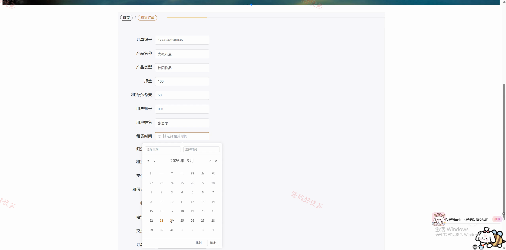
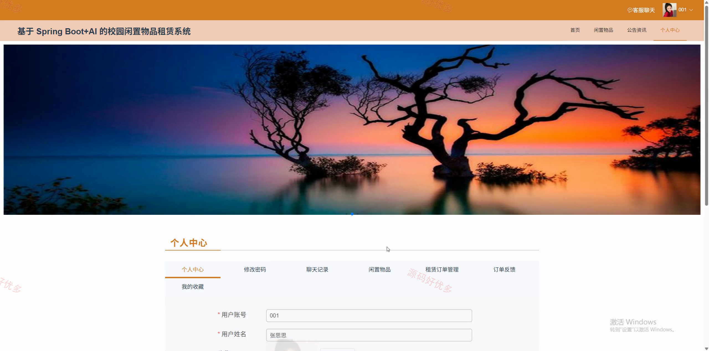
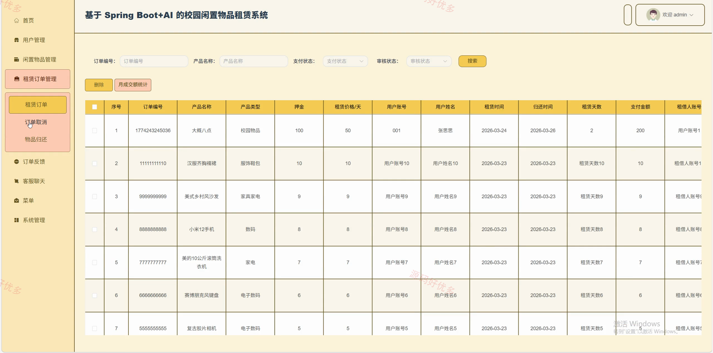
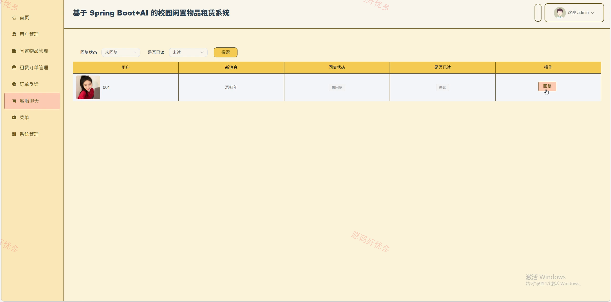
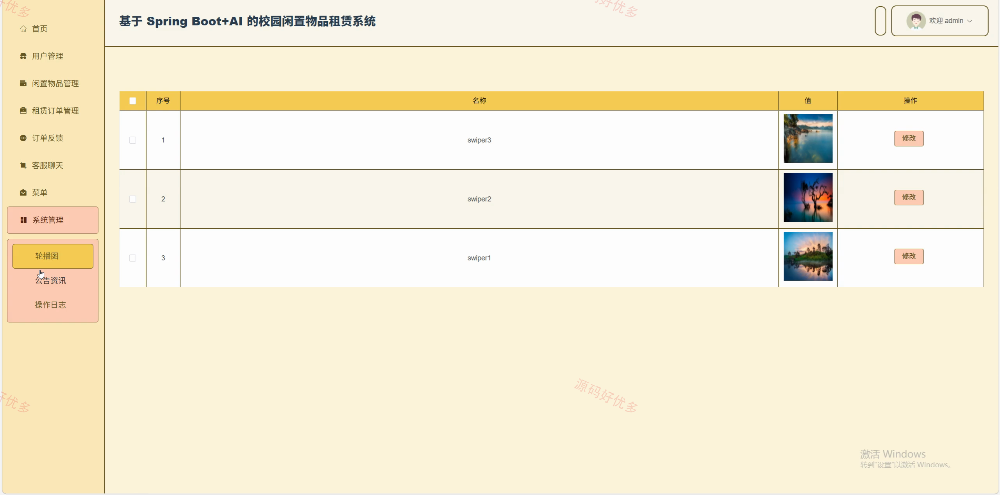
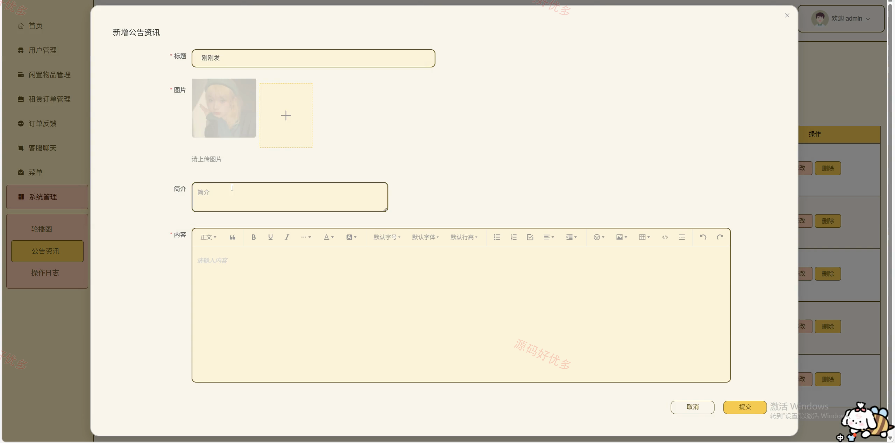

# springbootA657D-
springbootA657D 校园闲置物品租赁系统
## 源码问题查看主页咨询

### 一、关键词
校园闲置物品租赁系统、校园闲置物品租赁、校园闲置物品租赁信息管理、校园闲置物品租赁后台管理

### 二、作品包含
源码+数据库+全套环境和工具资源+本地部署教程

### 三、项目技术
前端技术： Html、Css、Js、Vue3.5、Element-Plus
后端技术：Java、SpringBoot3.3.0、MyBatis-Plus

### 四、运行环境（以下版本亲测，其他版本兼容性请自行测试）
开发工具：IDEA/eclipse + VSCODE

数据库：MySQL8.0+（共20张表）

数据库管理工具：Navicat10以上版本

环境配置软件： JDK17 + Maven3.6.3

前端Nodejs：16+

浏览器：谷歌浏览器

### 五、项目介绍
项目编号：springbootA657D

校园闲置物品租赁系统面向用户、管理员，提供闲置物品查看、闲置物品新增、闲置物品查看评论、闲置物品私信、闲置物品租赁、公告资讯查看、闲置物品管理等功能，实现各角色在系统中的实际业务协作。

角色：用户、管理员

用户功能：登录注册与个人中心、闲置物品发布与管理、闲置物品浏览评价收藏点赞、闲置物品私信、租赁下单与订单管理、租赁订单审核支付取消、物品归还与反馈、订单反馈管理。

管理员功能：后台登录、用户管理、闲置物品管理、租赁订单管理、订单反馈管理、客服聊天管理、菜单管理、系统管理。

### 六、运行截图

